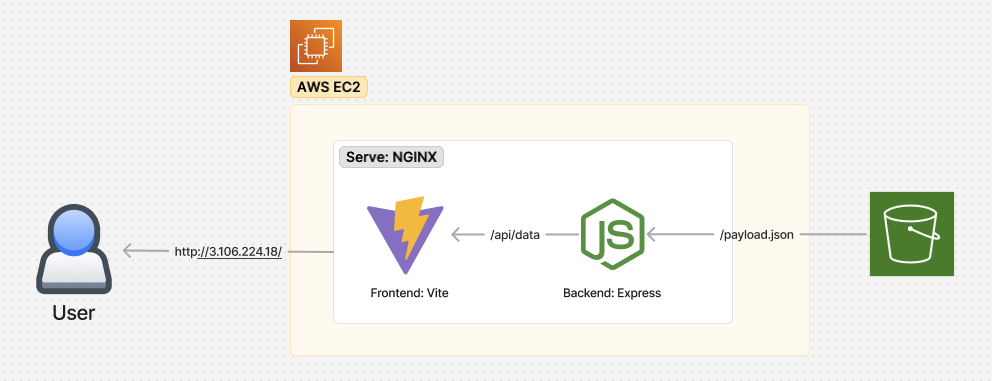

# **Quiz App Project** 🎉

## **Overview**

Welcome to the **Quiz App Project**! 🚀

You can access the application directly in your browser here: [http://3.106.224.18](http://3.106.224.18).

> **Note:** The application is currently not SSL-certified. However, for efficiency, SSL certification and a custom domain will be added as part of future enhancements.

## Features

- **Home Screen**: The home screen contains 2 buttons. Each button starts one of the two activities
- **Activity One Screen**: Activity one's flow includes a series of flat questions.
- **Activity Two Screen**: Activity two's flow includes a series of rounds with questions.
- **Result Screen**: Displays the score to the user after each eactivity, and also includes a button to link to the home screen

## This project consists of two main components:

1. **Web Application**: A front-end quiz application developed using React, TypeScript, and Vite, where users can participate in quizzes and receive instant feedback.
2. **Web Service**: A backend service built with Node.js and Express, designed to fetch quiz data from a remote JSON source. It functions as a proxy server to retrieve S3 payloads while bypassing CORS restrictions. Additionally, it can be extended to provide separate endpoints for validation, data processing, and other enhancements.

## Getting Started

To run the project:

1. Start the Web Application (webapp) check out the [WebApp README](webapp/README.md)
2. Start the Web Service (webservice) check out the [WebService README](webservice/README.md)
3. Open the web app in your browser and start taking quizzes! 🎉

## Architecture

Note: Express is provisioned as a proxy server to fetch S3 payload to bypass CORS issues

## Contributing

Contributions are welcome! If you would like to contribute to this project, please follow these steps:

1. Fork the repository.
2. Create a new branch for your feature or bug fix.
3. Make your changes and commit them.
4. Push your branch to your forked repository.
5. Create a pull request.
